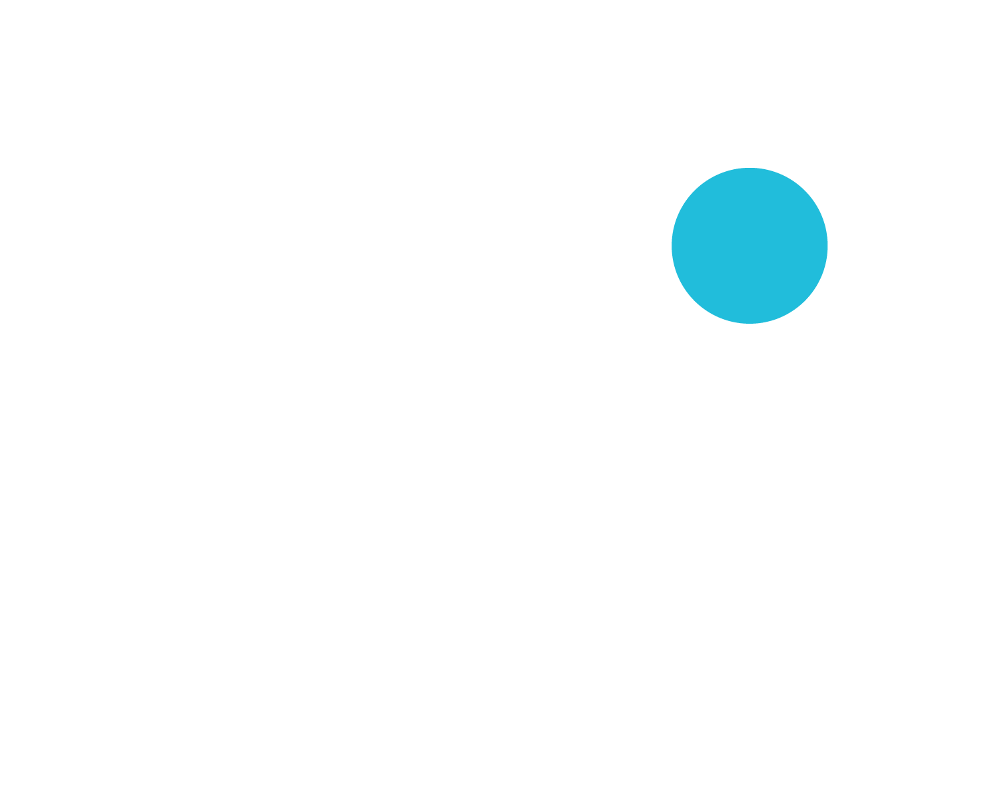

  

    
  

  <h3 align="center">
      Hello, I'm hayapo!
  </h3>

  <h3>
      Saito Hayato / 斉藤 隼人
  </h3>
  

    <h3> About me </h3>
    NeuroScience & Virtual Reality & Cognitive Science Enthusiast
    <h4>A student developer from Japan &#x1f1ef;&#x1f1f5;</h4>
    
  - 🌱 Frequently using **Python, TypeScript**
  - 🏫 I'm a Master student of Nagoya University.
  - 🎓 Trust Me, I'm A Cognitive Science Major.
  - 🧪 Researching BMI/BCI and Neuroscience. 
  

  

    
 
      
      
      
      
      
      
      
       
    

  

   
   

  

  <h3> My own Tech Blog </h3>
  https://blog.hayapo.dev/

  <h3> Connect with me🩺 </h3>
  
  
  

  
